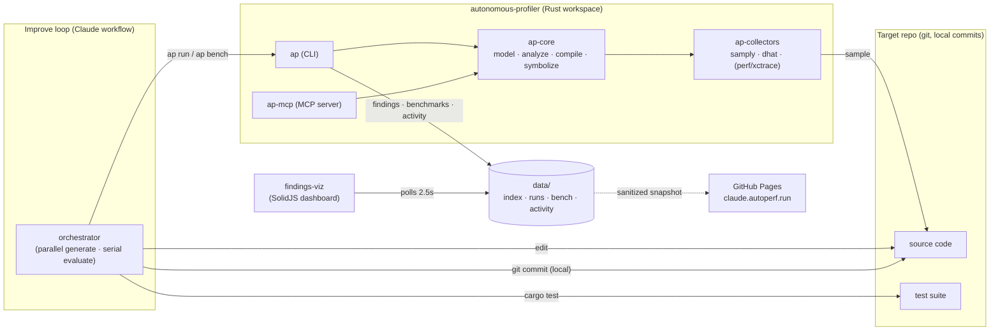
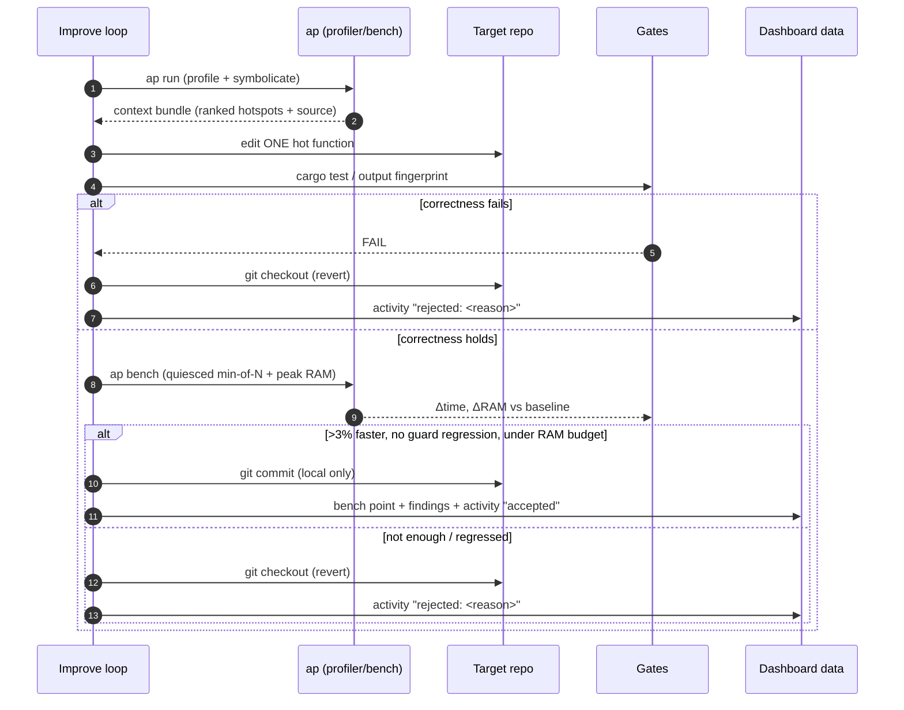
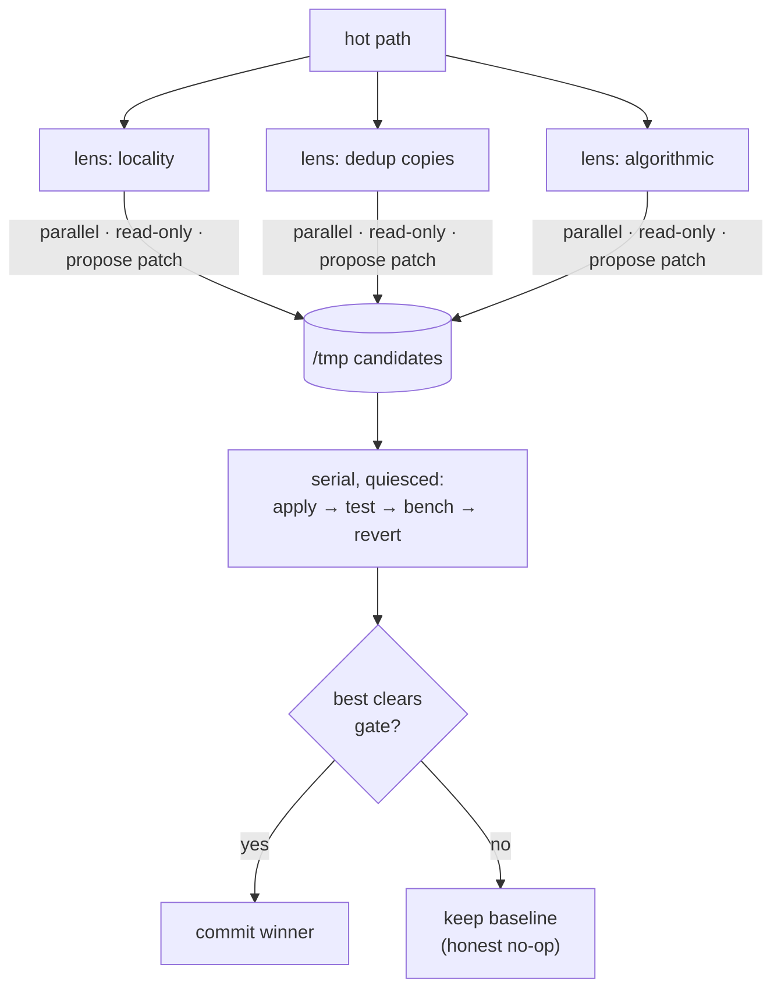

# autonomous-profiler

**An autonomous performance engineer for Rust.** Point it at a codebase; it profiles the
real hot paths, hands an LLM a *token-budgeted, source-attributed* brief of where the time
goes, then runs a closed loop that optimizes the code and **commits only changes that are
proven correct and measurably faster** — with a live dashboard of every attempt.

> 🔴 **Live dashboard:** https://claude.autoperf.run · 🏆 **[Highlight: it made polars 4% faster, provably](highlights/polars-resolve-chunked-idx.md)**

---

## What it actually did (results)

| Target | Outcome | Gate |
|---|---|---|
| **analyzer** (internal polars/ndarray analytics lib) | **−39%** flights / **−16%** transactions, **7 commits** | full `cargo test` suite |
| **polars** (the OSS dataframe library itself) | **−4.0%** on the sort/gather path, **1 commit** ([details](highlights/polars-resolve-chunked-idx.md)) | correctness fingerprint over 2.96M rows |
| swarm tournaments | diverse-lens rewrites; the **algorithmic lens landed a quantile-calculator win** the serial loop missed, while slower candidates self-reverted | benchmark + correctness |

The reverts matter as much as the wins: the loop **refuses to commit a regression or an
unverified change**. It also tried to out-hand-tune OpenBLAS/SIMD and correctly failed —
no fake wins.

---

## How it works (practical walkthrough)

```
1. ap run <target>        # profile with samply, symbolicate, rank hot functions
        │                 #   → token-budgeted "context bundle": top hotspots, crate
        │                 #     rollup, source snippets, why-hot tags  (md or json)
        ▼
2. LLM reads the bundle   # picks ONE hot function it owns, proposes an optimization
        ▼
3. cargo test  (or a deterministic output fingerprint for external targets)
        │  fail → git checkout (revert), log "rejected", next
        ▼ pass
4. ap bench <target>      # quiesced min-of-N wall-clock + peak RAM, per dataset
        │  not >3% faster, or a guard dataset regressed, or over RAM budget → revert
        ▼ win
5. git commit (local, never pushed)  +  ap activity "accepted"
        ▼
6. findings-viz dashboard polls the data dir → new green bar on the timeline, live
```

Everything is **gated and reversible**: a change is kept only if it passes the correctness
gate *and* improves the benchmark without regressing guard datasets or breaching a RAM
budget. Bench timing is always taken **serially/quiesced** so numbers are trustworthy.

### Quick start

```bash
cd autonomous-profiler && cargo install samply && cargo build
# profile any cargo project and print the LLM brief:
./target/debug/ap run <target> --example <name> --args <input>
# benchmark a workload (time + peak RAM, tagged by the target's git commit):
./target/debug/ap bench <target> --example <name> --label <name> --args <input>
cd ../findings-viz && pnpm install && pnpm dev      # dashboard on :5180
```

---

## Architecture (component view)



- **`ap-core`** — backend-neutral brain: a folded-stack IR, ranking/crate-rollup/hot-path
  analysis, the **context compiler** (token-budgeted brief), and symbolization.
- **`ap-collectors`** — profiling backends behind one trait: **samply** (CPU, real) and
  **dhat** (heap, real); `perf`/`xctrace` scaffolded. The neutral IR means a new backend
  changes nothing downstream.
- **`ap` / `ap-mcp`** — the same core as a CLI and as a local MCP server.
- **findings-viz** — live dashboard; a sanitized snapshot deploys to GitHub Pages.

## The optimize loop (sequence view)



## Swarm tournament (when one approach isn't enough)



Ideas are generated **in parallel** (cheap, read-only); evaluation is **serial and
quiesced** so the benchmark that decides the winner is never skewed by contention.

---

## Why the gates are trustworthy

- **Correctness is ground truth, not vibes.** Internal target → the real `cargo test`
  suite. External target (polars) → a deterministic **fingerprint** of the workload's
  output (value sum + exact row count + order-sensitive checksum) that must match the
  baseline bit-for-bit. The baseline output is assumed correct unless a bug is *proven*.
- **Timing is honest.** Benchmarks are min-of-N, taken serially with nothing else running;
  improvements must clear a threshold beyond noise, and guard datasets must not regress.
- **Memory is budgeted.** Peak RSS (and optional dhat heap) is recorded per commit; a
  change may trade memory for speed only under an explicit RAM ceiling.

See [`autonomous-profiler/README.md`](autonomous-profiler/README.md) for the full CLI/MCP
reference and internals.

## Repo layout

- **[autonomous-profiler/](autonomous-profiler/)** — the Rust tool (`ap` CLI + `ap-mcp` + core + collectors).
- **[findings-viz/](findings-viz/)** — the live SolidJS dashboard.
- **[highlights/](highlights/)** — written-up wins (e.g. the polars −4%).
- The **target repos** (the analytics lib, the polars clone) are separate git repos and are
  not committed here — the loop commits to them locally and never pushes.
